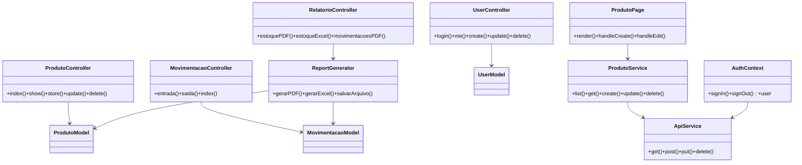

# DevStorange — Monorepo

> Visão unificada dos subprojetos **devostorage_api** (API) e **devostorage_web** (front-end).


Este README principal reúne a visão geral, diagramas de caso de uso e classes, instruções rápidas de execução e links para os READMEs específicos de cada subprojeto.

## Índice
- Visão Geral
- Como rodar rapidamente
- Diagramas
  - Caso de Uso (Mermaid)
  - Diagrama de Classes (Mermaid)
- Estrutura dos Subprojetos
- Links úteis

---

## Visão Geral

O monorepo contém dois subprojetos principais:

- `devostorage_api/` — API RESTful em PHP (CodeIgniter 4) responsável por autenticação, gerenciamento de produtos, movimentações e geração de relatórios (PDF / Excel).
- `devostorage_web/` — SPA em React + TypeScript que consome a API e fornece UI para gerenciamento, dashboard e downloads.

Este README centraliza os diagramas de Caso de Uso e de Classes para facilitar entendimento arquitetural do sistema como um todo.

---

## Como rodar rapidamente (ambientes locais)

Recomenda-se abrir dois terminais separados — um para a API e outro para o front-end.

PowerShell — iniciar API (CodeIgniter):
```powershell
cd c:\xampp\htdocs\devostorange\devostorage_api
composer install
cp env .env
# editar .env conforme necessário (database, JWT_SECRET, baseURL)
php spark migrate
php spark serve
```

PowerShell — iniciar Web (Vite):
```powershell
cd c:\xampp\htdocs\devostorange\devostorage_web
npm install
npm run dev
```

Observação: configure `VITE_API_URL` no front-end (arquivo `.env` ou `src/services/api.ts`) apontando para o `baseURL` da API.

---

## Diagramas

As seções abaixo usam Mermaid para diagramas. GitHub renderiza Mermaid nativamente — abra este arquivo no GitHub para visualizar os diagramas. Se quiser imagens estáticas, posso gerar SVG/PNG e adicioná-las ao repositório.

### Caso de Uso (visão macro)

```mermaid
usecaseDiagram
  actor Cliente as C
  rectangle API {
    C --> (Autenticar)
    C --> (Gerenciar Produtos)
    C --> (Registrar Movimentação)
    C --> (Gerar Relatórios)
    C --> (Baixar Relatório)
  }
  rectangle Frontend {
    C --> (Acessar Dashboard)
    C --> (Gerenciar Usuários)
  }
```

### Diagrama de Classes (nível alto — API e Front)



---

## Estrutura dos Subprojetos

- `devostorage_api/` — veja `devostorage_api/README.md` para documentação detalhada da API: endpoints, configuração, migrações e exemplos.
- `devostorage_web/` — veja `devostorage_web/README.md` para instruções do front-end, arquitetura de componentes e setup de desenvolvimento.

---

## Links úteis

- README da API: `devostorage_api/README.md`
- README do Front-end: `devostorage_web/README.md`

---

## Próximos passos que posso executar para você

- Gerar imagens SVG/PNG dos diagramas e adicioná-las em `/docs/assets/`.
- Criar um script de `bootstrap` para iniciar API + Web (PowerShell/Bash) em um só comando.
- Preparar um PR com o README principal e pequenas alterações de documentação.

Diga qual desses próximos passos prefere que eu execute.
