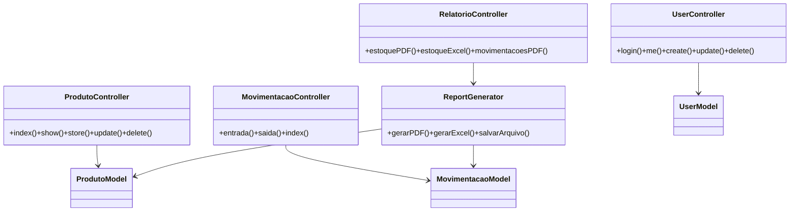

# DevOS Orange — API

> Nota: este é o README do subprojeto `devostorage_api`. Para a visão unificada e os diagramas principais, consulte o README na raiz: `../README.md`.

> Sistema RESTful para gestão de estoque, movimentações e geração de relatórios (PDF / Excel).


Resumo rápido: API desenvolvida com CodeIgniter 4, organizada em camadas (Controllers → Services → Models), autenticação JWT, geração de relatórios (mPDF / PhpSpreadsheet) e endpoints REST para usuários, produtos, movimentações e downloads.

**Índice**
- Características
- Tecnologias
- Instalação rápida
- Arquitetura (diagramas)
- Casos de uso (fluxos)
- Endpoints principais
- Boas práticas de segurança
- Contribuição e licença

---

## ✨ Características principais

- Autenticação JWT com filtros para rotas protegidas
- CRUD completo para produtos e usuários
- Registro de movimentações (entrada / saída) com tratamento transacional
- Geração de relatórios em PDF (mPDF) e Excel (PhpSpreadsheet)
- Download e listagem de arquivos gerados em `writable/uploads/`
- Logs e gerenciamento via `writable/logs` e `writable/cache`

---

## 🧰 Tecnologias

- PHP 8.1+
- CodeIgniter 4 (framework)
- MySQL (MariaDB compatível)
- firebase/php-jwt (autenticação)
- mpdf/mpdf (PDF)
- phpoffice/phpspreadsheet (Excel)
- Composer (dependências)

---

## 🚀 Instalação (rápida)

```powershell
git clone <repo-url> devostorage_api
cd devostorage_api
composer install
# copiar env
cp env .env
# ajustar .env (database, JWT_SECRET, baseURL)
php spark migrate
# iniciar servidor local
php spark serve
```

---

## 🏛 Arquitetura (visão em camadas)

O projeto segue uma arquitetura em camadas para separar responsabilidades:

- Controllers — tratam as requisições HTTP e validam input
- Services — lógica de negócio (transações, relatórios)
- Models — acesso ao banco (CodeIgniter Models)
- Filters — autenticação/autorizações (JWT)

### Diagrama de alto nível (Mermaid)

```mermaid
flowchart LR
  Client[Cliente (Web/Mobile/CLI)] -->|HTTP| API[API (CodeIgniter)]
  API --> Controllers
  Controllers --> Services
  Services --> Models
  Models --> DB[(MySQL)]
  Services -->|gera| Reports[Relatórios (mPDF/Excel)]
  Reports --> Uploads[writable/uploads]
  API -->|autenticação| Filters
```

### Diagrama de classes simplificado (Mermaid)



---

## 📌 Casos de Uso (fluxos resumidos)

1) Registrar Entrada de Estoque
- Cliente envia POST `/api/movimentacoes/entrada` com `produto_id` e `quantidade`.
- `MovimentacaoController` valida e delega a `Service` que inicia transação, insere movimentação, atualiza `ProdutoModel` e confirma transação.

2) Gerar Relatório Consolidado (Excel)
- Cliente solicita GET `/api/relatorios/estoque/excel`.
- `RelatorioController` chama `ReportGenerator::gerarExcelEstoque()` que busca dados via Models, monta o `Spreadsheet`, salva em `writable/uploads` e retorna URL.

3) Login e uso de recursos protegidos
- Cliente faz POST `/api/users/login` → `UserController` valida credenciais, gera JWT (exp, iat) usando `JWT_SECRET` e retorna token.
- Requisições subsequentes enviam `Authorization: Bearer <token>` para acessar rotas protegidas.

---

## 🔌 Endpoints Principais (resumo)

- POST `/api/users/login` — Autenticar e receber JWT
- GET `/api/users/me` — Perfil do usuário autenticado
- GET `/api/produtos` — Listar produtos
- POST `/api/produtos` — Criar produto
- POST `/api/movimentacoes/entrada` — Registrar entrada
- POST `/api/movimentacoes/saida` — Registrar saída
- GET `/api/relatorios/estoque/pdf|excel` — Gerar relatórios
- GET `/download/:file` — Baixar arquivo

Consulte os arquivos `QUICKSTART.md`, `RELATORIOS.md` e `EXEMPLOS_PRATICOS.md` para exemplos completos de requisições e respostas.

---

## 🔒 Segurança e Boas Práticas

- Armazenar `JWT_SECRET` em `.env` e não no código-fonte.
- Forçar HTTPS em produção (`app.baseURL` com https).
- Validar e sanitizar todos os inputs (Rules nos Models).
- Usar transações para operações de escrita que atualizam múltiplas tabelas.

---

## 🧪 Testes

Executar suite PHPUnit:

```powershell
composer test
# ou
./vendor/bin/phpunit
```

---

## 🤝 Contribuição

1. Fork
2. Branch: `feature/descricao` ou `fix/descricao`
3. Commit e push
4. Pull request com descrição do que foi alterado

---

## 📄 Licença

Este projeto está licenciado sob MIT — consulte `LICENSE`.


**Resposta**
```json
{
  "total_produtos": 5,
  "valor_total_estoque": 18500.00,
  "produtos": [
    {
      "id": 1,
      "nome": "Notebook",
      "quantidade": 15,
      "preco": 3200.00,
      "valor_total": 48000.00
    }
  ]
}
```

#### Exportar Estoque em PDF
```http
GET /api/relatorios/estoque/pdf
Authorization: Bearer TOKEN_JWT
```

#### Exportar Estoque em Excel
```http
GET /api/relatorios/estoque/excel
Authorization: Bearer TOKEN_JWT
```

#### Relatório de Movimentações (JSON)
```http
GET /api/relatorios/movimentacoes
Authorization: Bearer TOKEN_JWT
```

#### Exportar Movimentações em PDF
```http
GET /api/relatorios/movimentacoes/pdf
Authorization: Bearer TOKEN_JWT
```

#### Exportar Movimentações em Excel
```http
GET /api/relatorios/movimentacoes/excel
Authorization: Bearer TOKEN_JWT
```

#### Movimentações de um Produto
```http
GET /api/relatorios/produto/1/movimentacoes
Authorization: Bearer TOKEN_JWT
```

---

### Downloads

#### Listar Arquivos Gerados
```http
GET /api/downloads
Authorization: Bearer TOKEN_JWT
```

**Resposta**
```json
{
  "total": 2,
  "arquivos": [
    {
      "nome": "relatorio_estoque_2025-11-29_14-58-09.pdf",
      "tamanho": "245 KB",
      "tamanho_bytes": 250880,
      "data_criacao": "29/11/2025 14:58:09",
      "url_download": "/download/relatorio_estoque_2025-11-29_14-58-09.pdf"
    }
  ]
}
```

#### Download Direto
```http
GET /download/relatorio_estoque_2025-11-29_14-58-09.pdf
```

---

## 💡 Casos de Uso

### Caso de Uso 1: Registrar Nova Entrada de Estoque

**Fluxo:**
1. Usuário autenticado faz POST para `/api/movimentacoes/entrada`
2. Sistema valida produto e quantidade
3. Inicia transação no banco
4. Insere registro na tabela `movimentacoes`
5. Atualiza quantidade na tabela `produtos`
6. Confirma transação
7. Retorna ID da movimentação

**Tecnologias Envolvidas:**
- JWT (autenticação)
- MySQL Transactions (ACID compliance)
- CodeIgniter Models & Validation

**Exemplo com cURL:**
```bash
curl -X POST http://localhost:8080/api/movimentacoes/entrada \
  -H "Authorization: Bearer seu_token_jwt" \
  -H "Content-Type: application/json" \
  -d '{
    "produto_id": 1,
    "quantidade": 10,
    "observacao": "Chegada de mercadoria"
  }'
```

---

### Caso de Uso 2: Gerar Relatório Consolidado em Excel

**Fluxo:**
1. Usuário faz GET para `/api/relatorios/estoque/excel`
2. RelatorioController chama ReportGenerator::gerarExcelEstoque()
3. ReportGenerator busca dados do banco (JOIN com movimentações)
4. PhpSpreadsheet cria workbook com:
   - Cabeçalho formatado
   - Tabela de produtos
   - Cálculos de valor total
   - Formatação monetária (R$)
5. Salva arquivo em `writable/uploads/`
6. Retorna nome do arquivo
7. Usuário baixa via `/download/relatorio_estoque_2025-11-29_15-00-43.xlsx`

**Tecnologias Envolvidas:**
- CodeIgniter Models
- PhpSpreadsheet v5.3
- MySQL JOINs
- File I/O

**Arquitetura da ReportGenerator:**
```php
class ReportGenerator {
    public function gerarExcelEstoque() {
        // 1. Buscar dados
        $produtos = $this->produtoModel->with('movimentacoes')->findAll();
        
        // 2. Criar spreadsheet
        $spreadsheet = new Spreadsheet();
        
        // 3. Adicionar dados e formatação
        // - Headers azuis com borda
        // - Números com 2 casas decimais
        // - Moeda em formato R$
        
        // 4. Salvar arquivo
        // Retornar caminho
    }
}
```

---

### Caso de Uso 3: Rastrear Movimentações de um Produto

**Fluxo:**
1. Usuário faz GET para `/api/relatorios/produto/1/movimentacoes`
2. RelatorioController busca histórico completo do produto
3. MovimentacaoModel retorna movimentações com:
   - Tipo (entrada/saída)
   - Quantidade
   - Usuário responsável
   - Data/hora
   - Observações
4. Retorna JSON ordenado por data

**Tecnologias Envolvidas:**
- MySQL JOINs (movimentacoes + usuarios)
- CodeIgniter Query Builder
- JSON serialization

**Consulta SQL Aproximada:**
```sql
SELECT 
    m.*,
    u.nome as usuario_nome,
    p.nome as produto_nome
FROM movimentacoes m
JOIN usuarios u ON m.usuario_id = u.id
JOIN produtos p ON m.produto_id = p.id
WHERE m.produto_id = 1
ORDER BY m.created_at DESC
```

---

### Caso de Uso 4: Autenticação e Renovação de Token

**Fluxo:**
1. Cliente faz POST para `/api/users/login` com email e senha
2. UserController busca usuário no banco
3. Valida senha com hash (password_verify)
4. Gera JWT com Firebase\JWT:
   - Payload: id, email, tipo (admin/user), iat, exp
   - Algoritmo: HS256
   - Secret: variável de ambiente
5. Retorna token ao cliente
6. Cliente inclui token em Authorization header

**Tecnologias Envolvidas:**
- Firebase JWT v6.11
- PHP password_hash/password_verify
- Asymmetric cryptography (HS256)

**Estrutura do JWT:**
```
Header: { "alg": "HS256", "typ": "JWT" }
Payload: {
  "id": 1,
  "email": "admin@local.com.br",
  "tipo": "admin",
  "iat": 1732905000,
  "exp": 1732991400
}
Signature: HMACSHA256(base64url(header) + "." + base64url(payload), secret)
```

---

## 📚 Documentação Detalhada

A documentação completa está organizada em múltiplos arquivos:

| Arquivo | Conteúdo |
|---------|----------|
| `QUICKSTART.md` | Guia rápido de início |
| `EXEMPLOS_PRATICOS.md` | Exemplos práticos com cURL |
| `RELATORIOS.md` | Documentação de relatórios |
| `ARQUITETURA.md` | Diagrama e explicação da arquitetura |
| `SUMARIO_EXECUTIVO.md` | Resumo das funcionalidades |

---

## 🧪 Testes

### Executar testes
```bash
composer test

# Ou com PHPUnit diretamente
./vendor/bin/phpunit
```

### Testes disponíveis
```
tests/
├── unit/
│   └── HealthTest.php          # Testes de saúde da API
├── database/
│   └── ExampleDatabaseTest.php # Testes de conexão DB
└── session/
    └── ExampleSessionTest.php  # Testes de sessão
```

---

## 🔒 Segurança

### Boas Práticas Implementadas

✅ **Autenticação JWT**
- Tokens com expiração configurável
- Secret armazenado em variável de ambiente
- Validação em todas as rotas protegidas

✅ **Validação de Entrada**
- Rules configuradas nos Models
- Sanitização automática
- Rejeição de dados inválidos

✅ **Controle de Acesso**
- Filtro JWT em rotas sensíveis
- Verificação de propriedade (um usuário não pode acessar dados de outro)

✅ **Tratamento de Erros**
- Respostas padronizadas
- Sem exposição de stack traces em produção
- Logging de erros críticos

✅ **CORS**
- Configurável por domínio
- Validação de origin

### Recomendações para Produção

1. **HTTPS obrigatório**
   ```env
   app.baseURL = 'https://sua-api.com/'
   ```

2. **Aumentar expiração de token com cuidado**
   ```php
   // Em UserController::login()
   $exp = time() + (3600 * 24 * 7); // 7 dias
   ```

3. **Implementar rate limiting**
   ```php
   // Adicionar extensão ou middleware de rate limiting
   ```

4. **Logging detalhado**
   ```env
   CI_ENVIRONMENT = production
   log.threshold = 2 // Apenas errors e crítico
   ```

5. **Backup regular do banco**
   ```bash
   mysqldump -u root -p seu_banco > backup_$(date +%Y%m%d).sql
   ```

---

## 🐛 Troubleshooting

### Erro: "Token não informado"
```
HTTP/1.1 401 Unauthorized
{"error": "Token não informado."}
```

**Solução:**
- Verificar se Authorization header está sendo enviado
- Formato correto: `Authorization: Bearer TOKEN_AQUI`

```bash
# ✓ Correto
curl -H "Authorization: Bearer eyJh..." http://localhost:8080/api/usuarios/me

# ✗ Errado
curl -H "Authorization: eyJh..." http://localhost:8080/api/usuarios/me
```

---

### Erro: "Token inválido ou expirado"
```
HTTP/1.1 401 Unauthorized
{"error": "Token inválido ou expirado."}
```

**Solução:**
1. Gerar novo token via `/api/users/login`
2. Verificar se JWT_SECRET está correto em `.env`
3. Verificar expiração do token (exp claim)

---

### Erro: "Usuário não autenticado"
```json
{"error": "Usuário não autenticado"}
```

**Solução:**
- JWTAuthFilter valida token e seta usuário em `service('authUser')`
- Se erro persiste:
  1. Verificar se token é válido (use jwt.io para decodificar)
  2. Verificar se JWT_SECRET em `.env` bate com token gerado

---

### Erro: "Produto não encontrado"
```
HTTP/1.1 404 Not Found
{"messages": {"error": "Produto não encontrado."}}
```

**Solução:**
- ID do produto existe no banco?
- Verificar em `/api/produtos`

```bash
curl -H "Authorization: Bearer TOKEN" http://localhost:8080/api/produtos | jq '.[] | {id, nome}'
```

---

### Erro: Movimentações não salvam no banco
```
HTTP/1.1 400 Bad Request
{"messages": {"produto_id": "Required"}}
```

**Solução:**
- Verificar validação no MovimentacaoModel
- Campos obrigatórios: `produto_id`, `quantidade`, `tipo`
- Quantidade deve ser > 0
- produto_id deve existir

---

### Erro: Relatório não gera PDF
```
MPDF Error: Could not write PDF
```

**Solução:**
1. Verificar permissões de escrita em `writable/uploads/`
   ```bash
   ls -la writable/uploads/
   chmod 755 writable/uploads/
   ```

2. Verificar espaço em disco
   ```bash
   df -h
   ```

3. Verificar se MPDF está instalado
   ```bash
   ls vendor/mpdf/mpdf
   ```

---

### Performance: API lenta
**Diagnóstico:**
1. Ativar Profiler do CodeIgniter
   ```env
   CI_ENVIRONMENT = development
   ```

2. Usar `spark db:monitor`
   ```bash
   php spark db:monitor
   ```

3. Verificar índices no banco
   ```sql
   SHOW INDEXES FROM produtos;
   ```

**Otimizações:**
- Adicionar índices em foreign keys
- Implementar paginação em listagens grandes
- Cache via Redis/Memcached

---

## 📝 Logs

Logs são armazenados em:
```
writable/logs/log-YYYY-MM-DD.log
```

### Visualizar logs
```bash
# Últimas 50 linhas
tail -50 writable/logs/log-*.log

# Buscar erros
grep "ERROR\|CRITICAL" writable/logs/log-*.log
```

---

## 📞 Suporte

### Documentação Adicional
- [CodeIgniter 4 Docs](https://codeigniter.com/user_guide/)
- [Firebase JWT](https://github.com/firebase/php-jwt)
- [MPDF Documentation](https://mpdf.github.io/)
- [PhpSpreadsheet](https://phpspreadsheet.readthedocs.io/)

### Relatar Bugs
Abra uma issue no GitHub com:
- Descrição clara do problema
- Passos para reproduzir
- Versão do PHP e MySQL
- Stack trace completo (se disponível)

---

## 📄 Licença

Este projeto está licenciado sob a Licença MIT - veja o arquivo [LICENSE](LICENSE) para detalhes.

---

## 🤝 Contribuindo

Contribuições são bem-vindas! Por favor:

1. Fork o projeto
2. Crie uma branch para sua feature (`git checkout -b feature/MinhaFeature`)
3. Commit suas mudanças (`git commit -am 'Adiciona MinhaFeature'`)
4. Push para a branch (`git push origin feature/MinhaFeature`)
5. Abra um Pull Request

---

## 📊 Status do Projeto

| Feature | Status |
|---------|--------|
| Autenticação JWT | ✅ Completo |
| CRUD de Produtos | ✅ Completo |
| Movimentações | ✅ Completo |
| Relatórios PDF | ✅ Completo |
| Relatórios Excel | ✅ Completo |
| Listagem de Downloads | ✅ Completo |
| Testes Unitários | 🔄 Em Desenvolvimento |
| Documentação API | ✅ Completo |

---

**Desenvolvido com ❤️ para DevOS Orange**

*Última atualização: 29 de Novembro de 2025*
